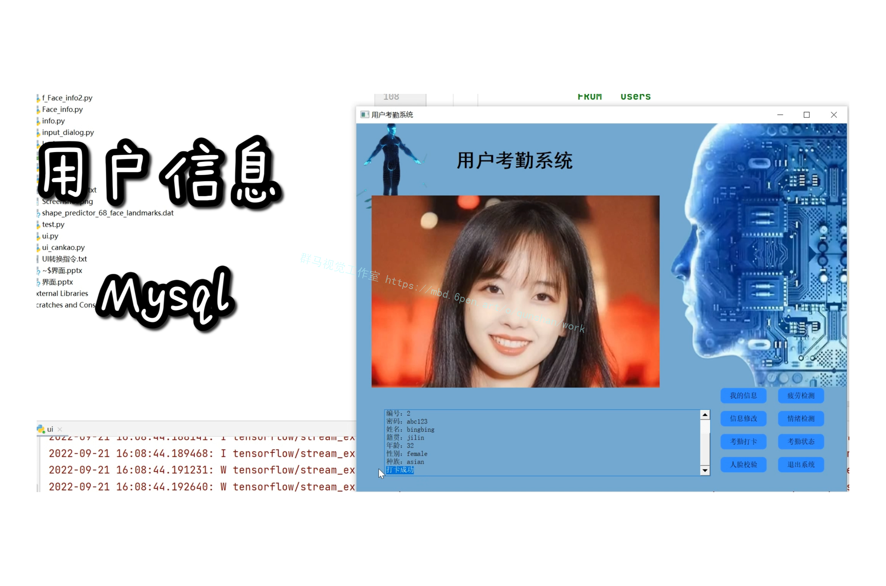
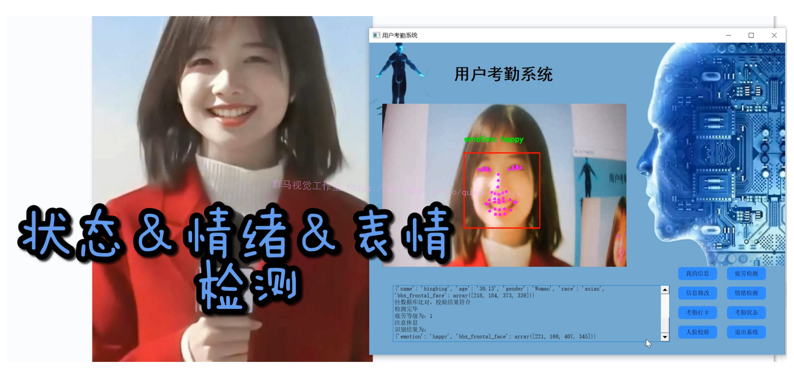
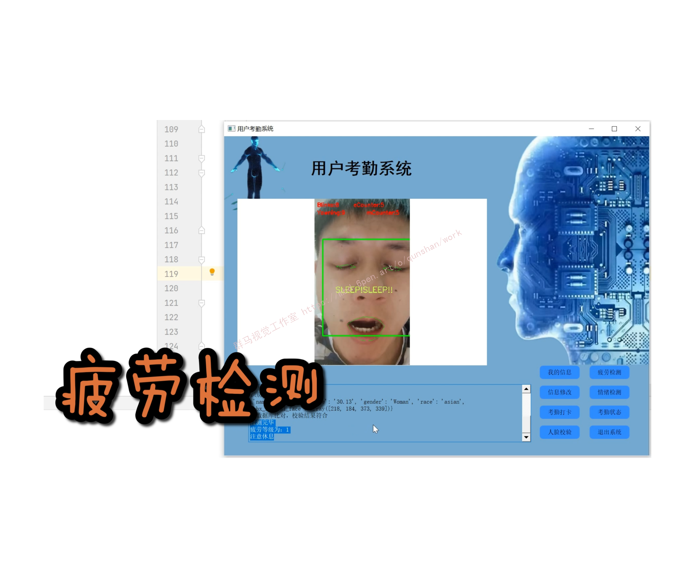

# 1.研究背景
随着人工智能时代的来临，深度学习赋予了以人脸图像为中心的计算机视觉任务更多的可能。人脸检测是人脸识别系统组成的关键部分之一，其目的是检测出任意给定图片中的包含的一个或多个人脸，是人脸识别、表情识别等下游任务的基础。人脸识别是通过采集包含人脸的图像或视频数据，通过对比和分析人脸特征信息从而实现身份识别的生物识别技术，是人脸识别系统的核心组件。如今人脸识别系统广泛应用于写字楼、学校、医院和车站等需要对入场人员身份信息进行确认和鉴别的场所。进而利用人脸检测算法检测出摄像头拍摄图片中包含的人脸，再使用识别算法对比当前人脸特征和数据库内的人脸特征，确认人员身份，最终输出人员相关的身份信息并生成打卡记录。在实际的运行测试中，针对戴口罩的场景也有优异的表现，满足公司打卡应用的实际需求。 

# 2.视频演示
[基于OpenCV的刷脸考勤＆人脸校验＆用户管理系统（源码＆教程）_哔哩哔哩_bilibili](https://www.bilibili.com/video/BV17D4y1i79C/?vd_source=bc9aec86d164b67a7004b996143742dc)


# 3.考勤打卡算法原理
#### 人脸识别
基于Python语言，通过对图像预处理、提取特征向量、与人脸数据库中数据进行校验进而判别人物身份的一项技术。具体流程图如图所示。

(1)人脸图像采集与对齐:首先 Dlib检测人脸并输出人脸矩形的四个坐标点，即在图片中识别到人脸的位置。然后由OpenCV ( Open Source Computer Vision Library)从底层采集人脸图像并转换成数据集，并通过对图像的灰度化、二值化等对人脸图像进行预处理【5】。
人脸对齐即在检测到的人脸矩阵中找到人脸上的眼鼻口和脸部轮廓等标志性特征向量。
(2)计算人脸图像与待识别人脸对应的特征向量:首先利用Dlib中的梯度提升树(Gradient Boosting Deci-sion Tree,GBDT)提取人脸68个特征点【6】。再利用ResNet残差学习深度神经网络为待识别人脸创建128维特征向量T。
(3)计算人脸间的欧式距离:假设数据库中的人脸图像向量与待识别人脸向量分别为x (x1,x2,X3…,Xn)与y(yi,y2zy3.….yn)，根据欧式距离公式(1）计算两向量欧式距离,为人脸校验提供数据。
(4)人脸校验:两个人脸特征向量的欧式距离越小，则两张人脸越相似，若人脸图像与待识别人像之间的欧式距离小于设定的阈值时，则判定为同一人。

#### 算法流程图


# 4.刷脸＆密码登录（用户＆管理员）


### 代码实现
#### 用户注册
```
    def register(self):
        username = self.textEdit_1.toPlainText()
        password = self.textEdit_2.toPlainText()
        #print(username,password)


        # 执行的都是原生SQL语句
        sql = '''
        SELECT Name
        FROM   users
        '''

        has_name = 0
        for row in self.get(sql):
            if username == str(row[0]):
                #print(row)
                has_name = 1
                self.textEdit_1.setText('用户已经注册')
                break
        if not has_name:
            savepath = './images_db'
            if not os.path.exists(savepath):
                os.makedirs(savepath)
            # 打开摄像头
            detector = dlib.get_frontal_face_detector()
            predictor = dlib.shape_predictor("shape_predictor_68_face_landmarks.dat")
            cap = cv2.VideoCapture(0)
            for x in range(50):
                ret, image = cap.read()
                imagecopy = image.copy()
                img_gray = cv2.cvtColor(image, cv2.COLOR_RGB2GRAY)

                # 使用人脸检测器检测每一帧图像中的人脸。并返回人脸数rects
                faces = detector(img_gray, 0)

                # 待会要显示在屏幕上的字体
                font = cv2.FONT_HERSHEY_SIMPLEX

                # 如果检测到人脸
                if (len(faces) != 0):

                    for i in range(len(faces)):
                        # enumerate方法同时返回数据对象的索引和数据，k为索引，d为faces中的对象
                        for k, d in enumerate(faces):
                            # 用红色矩形框出人脸
                            cv2.rectangle(imagecopy, (d.left(), d.top()), (d.right(), d.bottom()), (0, 255, 0))
                            # 计算人脸热别框边长
                            face_width = d.right() - d.left()

                            shape = predictor(image, d)
                            mouth_width = (shape.part(54).x - shape.part(48).x) / face_width  # 嘴巴咧开程度
                            mouth_higth = (shape.part(66).y - shape.part(62).y) / face_width  # 嘴巴张开程度
                            for i in range(68):
                                if i > 27:
                                    cv2.circle(imagecopy, (shape.part(i).x, shape.part(i).y), 2, (0, 0, 255), -1, 2)

                self.showimg(imagecopy)
                QApplication.processEvents()
            cv2.imwrite(savepath + '/' + str(username) + '.jpg', image, [int(cv2.IMWRITE_JPEG_QUALITY), 100])
            val = (str(username),str(password))
            sql = 'insert into users (Name , Password) values (%s, %s)'
            self.add(sql, val)
            self.textEdit_1.setText('注册成功')
```
#### 用户登录
```
    def login(self):
        global inname
        username = self.textEdit_1.toPlainText()
        password = self.textEdit_2.toPlainText()
        # print(username,password)

        # 执行的都是原生SQL语句
        sql = '''
                SELECT Name, Password
                FROM   users
                '''
        has_name = 0
        for row in self.get(sql):
            if username == 'administrator' and username == str(row[0]):
                has_name = 1
                if password == str(row[1]):
                    print('密码正确，登陆成功')
                    inname = str(row[0])
                    MainWindow.close()
                    ui4.show()
                    try:
                        show = cv2.imread('./images_db/' + str(inname) + '.jpg')
                        ui4.showimg(show)
                    except:
                        pass
                    ui4.printf('密码正确，登陆成功')
                    ui4.printf('欢迎您,管理员')
                else:
                    self.textEdit_2.setText('密码错误')
                break

            if username == str(row[0]):
                # print(row)
                has_name = 1
                if password == str(row[1]):
                    print('密码正确，登陆成功')
                    inname = str(row[0])
                    MainWindow.close()
                    ui2.show()
                    try:
                        show = cv2.imread('./images_db/' + str(inname) + '.jpg')
                        ui2.showimg(show)
                    except:
                        pass
                    ui2.printf('密码正确，登陆成功')
                    ui2.printf('欢迎您 ' + str(inname))
                else:
                    self.textEdit_2.setText('密码错误')
                break

        if not has_name:
            self.textEdit_1.setText('该用户不存在')
```

# 5.用户考勤打卡＆管理员考勤查看




# 6.管理员用户信息管理＆Mysql增删改查

#### MySQL的主要优势
运行速度快，MySQL体积小，命令执行的速度快。
使用成本低。MySQL是开源的，且提供免费版本，对大多数用户来说大大降低了使用成本。
使用容易。与其他大型数据库的设置和管理相比，其复杂程度较低，易于使用。
可移植性强。MySQL能够运行与多种系统平台上，如windouws，Linux，Unix等。
适用更多用户。MySQL支持最常用的数据管理功能，适用于中小型企业甚至大型网站应用。

#### Mysql增删改查
代码实现如下
```
    def get(self,sql):
        try:
            conn = MySQLdb.connect(
                host=host,  # 主机名
                user=user,  # 用户名
                passwd=passwd,  # 密码
                db=db)  # 数据库名

            # 查询前，必须先获取游标
            cursor = conn.cursor()
            cursor.execute(sql)
            results = cursor.fetchall()
            cursor.close()  # 关闭游标连接
            conn.close()  # 关闭数据库连接
            return results
        except Exception:
            print("查询失败")

    def update(self,sql,cg):
        try:
            conn = MySQLdb.connect(
                host=host,  # 主机名
                user=user,  # 用户名
                passwd=passwd,  # 密码
                db=db)  # 数据库名

            # 查询前，必须先获取游标
            cursor = conn.cursor()
            cursor.execute(sql,cg)
            conn.commit()     # 提交
            cursor.close()  # 关闭游标连接
            conn.close()  # 关闭数据库连接

        except Exception:
            print("修改失败")

    def add(self,sql,val):
        try:
            conn = MySQLdb.connect(
                host=host,  # 主机名
                user=user,  # 用户名
                passwd=passwd,  # 密码
                db=db)  # 数据库名

            # 查询前，必须先获取游标
            cursor = conn.cursor()
            cursor.execute(sql, val)
            conn.commit()     # 提交
            cursor.close()  # 关闭游标连接
            conn.close()  # 关闭数据库连接
        except Exception:
            print("插入失败")

    def delete(self,sql):
        try:
            conn = MySQLdb.connect(
                host=host,  # 主机名
                user=user,  # 用户名
                passwd=passwd,  # 密码
                db=db)  # 数据库名

            # 查询前，必须先获取游标
            cursor = conn.cursor()
            cursor.execute(sql)
            conn.commit()
            cursor.close()  # 关闭游标连接
            conn.close()  # 关闭数据库连接
        except Exception:
            print("删除失败")
```


# 7.人脸校验＆年龄、性别、民族识别（防替考＆本人检测）


[参考原博客提出的思路](https://afdian.net/item?plan_id=04e140385cb511edaa2052540025c377)

#### 代码实现
```
import cv2
import numpy as np
import face_recognition
from age_detection import f_my_age
from gender_detection import f_my_gender
from race_detection import f_my_race
from emotion_detection import f_emotion_detection
from my_face_recognition import f_main


# instanciar detectores
age_detector = f_my_age.Age_Model()
gender_detector =  f_my_gender.Gender_Model()
race_detector = f_my_race.Race_Model()
emotion_detector = f_emotion_detection.predict_emotions()
rec_face = f_main.rec()
#----------------------------------------------


def get_face_info(im):
    # face detection
    boxes_face = face_recognition.face_locations(im)
    out = []
    if len(boxes_face)!=0:
        for box_face in boxes_face:
            # segmento rostro
            box_face_fc = box_face
            x0,y1,x1,y0 = box_face
            box_face = np.array([y0,x0,y1,x1])
            face_features = {
                "name":[],
                "age":[],
                "gender":[],
                "race":[],
                "emotion":[],
                "bbx_frontal_face":box_face             
            } 

            face_image = im[x0:x1,y0:y1]

            # -------------------------------------- face_recognition ---------------------------------------
            face_features["name"] = rec_face.recognize_face2(im,[box_face_fc])[0]

            # -------------------------------------- age_detection ---------------------------------------
            age = age_detector.predict_age(face_image)
            face_features["age"] = str(round(age,2))

            # -------------------------------------- gender_detection ---------------------------------------
            face_features["gender"] = gender_detector.predict_gender(face_image)

            # -------------------------------------- race_detection ---------------------------------------
            face_features["race"] = race_detector.predict_race(face_image)

            # -------------------------------------- emotion_detection ---------------------------------------
            _,emotion = emotion_detector.get_emotion(im,[box_face])
            face_features["emotion"] = emotion[0]

            # -------------------------------------- out ---------------------------------------       
            out.append(face_features)
    else:
        face_features = {
            "name":[],
            "age":[],
            "gender":[],
            "race":[],
            "emotion":[],
            "bbx_frontal_face":[]             
        }
        out.append(face_features)
    return out


def bounding_box(out,img):
    for data_face in out:
        box = data_face["bbx_frontal_face"]
        if len(box) == 0:
            continue
        else:
            x0,y0,x1,y1 = box
            img = cv2.rectangle(img,
                            (x0,y0),
                            (x1,y1),
                            (0,0,255),2);
            thickness = 2
            fontSize = 0.6
            step = 13

            try:
                cv2.putText(img, "age: " +data_face["age"], (x0, y0-7), cv2.FONT_HERSHEY_SIMPLEX, fontSize, (0,255,0), thickness)
            except:
                pass
            try:
                cv2.putText(img, "gender: " +data_face["gender"], (x0, y0-step-15*1), cv2.FONT_HERSHEY_SIMPLEX, fontSize, (0,255,0), thickness)
            except:
                pass
            try:
                cv2.putText(img, "race: " +data_face["race"], (x0, y0-step-15*2), cv2.FONT_HERSHEY_SIMPLEX, fontSize, (0,255,0), thickness)
            except:
                pass
            try:
                cv2.putText(img, "emotion: " +data_face["emotion"], (x0, y0-step-15*3), cv2.FONT_HERSHEY_SIMPLEX, fontSize, (0,255,0), thickness)
            except:
                pass
            try:
                cv2.putText(img, "name: " +data_face["name"], (x0, y0-step-15*4), cv2.FONT_HERSHEY_SIMPLEX, fontSize, (0,255,0), thickness)
            except:
                pass
    return img

```

# 8.情绪＆状态＆表情识别（用户状态监测）




[参考原博客提出的方案](https://mbd.pub/o/bread/Y5ebl59u)

#### 背景
面部表情识别技术主要的应用领域包括人机交互、智能控制、安全、医疗、通信等领域。笔者目前接触过的两个领域， 
　　第一个是商场门店的顾客情绪分析。即通过摄像头捕获商场或门店的顾客画面，分析其面部表情，再进一步解读出客人的情绪信息，从而分析顾客在商场的体验满意度。 
　　第二个是人机交互。在笔者参与的一个教育辅助机器人项目中，负责视觉部分的研发工作，其中一项功能就是通过面部表情分析来判断机器人眼前的用户的情绪和心理。 

#### 代码实现
```
#encoding:utf-8
import pandas as pd
import numpy as np
import scipy.misc as sm
import os
 
emotions = {
    '0':'anger', #生气
    '1':'disgust', #厌恶
    '2':'fear', #恐惧
    '3':'happy', #开心
    '4':'sad', #伤心
    '5':'surprised', #惊讶
    '6':'normal', #中性
}
 
#创建文件夹
def createDir(dir):
    if os.path.exists(dir) is False:
        os.makedirs(dir)
 
def saveImageFromFer2013(file):
 
 
    #读取csv文件
    faces_data = pd.read_csv(file)
    imageCount = 0
    #遍历csv文件内容，并将图片数据按分类保存
    for index in range(len(faces_data)):
        #解析每一行csv文件内容
        emotion_data = faces_data.loc[index][0]
        image_data = faces_data.loc[index][1]
        usage_data = faces_data.loc[index][2]
        #将图片数据转换成48*48
        data_array = list(map(float, image_data.split()))
        data_array = np.asarray(data_array)
        image = data_array.reshape(48, 48)
 
        #选择分类，并创建文件名
        dirName = usage_data
        emotionName = emotions[str(emotion_data)]
 
        #图片要保存的文件夹
        imagePath = os.path.join(dirName, emotionName)
 
        # 创建“用途文件夹”和“表情”文件夹
        createDir(dirName)
        createDir(imagePath)
 
        #图片文件名
        imageName = os.path.join(imagePath, str(index) + '.jpg')
 
        sm.toimage(image).save(imageName)
        imageCount = index
    print('总共有' + str(imageCount) + '张图片')
 
 
if __name__ == '__main__':
    saveImageFromFer2013('fer2013.csv')

```

# 9.用户疲劳检测



## 参考原博客
[(6条消息) Python基于OpenCV的工作疲劳检测系统[源码＆UI界面＆部署教程]_weixin__qunmasj的博客-CSDN博客](https://blog.csdn.net/weixin__qunmasj/article/details/126794714?spm=1001.2014.3001.5502)

#### 算法逻辑
定义 EYE_AR_THRESH。如果眼睛纵横比低于此阈值，我们将开始计算人闭上眼睛的帧数。
如果该人闭上眼睛的帧数超过 EYE_AR_CONSEC_FRAMES，我们将发出警报。

在实验中，我发现 0.3 的 EYE_AR_THRESH 在各种情况下都能很好地工作（尽管您可能需要为自己的应用程序自己调整它）。

我还将 EYE_AR_CONSEC_FRAMES 设置为 48 ，这意味着如果一个人连续闭眼 48 帧，我们将播放警报声。

您可以通过降低 EYE_AR_CONSEC_FRAMES 来使疲劳检测器更敏感——同样，您可以通过增加它来降低疲劳检测器的敏感度。

定义了 COUNTER，即眼睛纵横比低于 EYE_AR_THRESH 的连续帧的总数。

如果 COUNTER 超过 EYE_AR_CONSEC_FRAMES ，那么我们将更新布尔值 ALARM_ON。
```
# start the video stream thread

print("[INFO] starting video stream thread...")

vs = VideoStream(src=args["webcam"]).start()

time.sleep(1.0)

# loop over frames from the video stream

while True:

    # grab the frame from the threaded video file stream, resize

    # it, and convert it to grayscale

    # channels)

    frame = vs.read()

    frame = imutils.resize(frame, width=450)

    gray = cv2.cvtColor(frame, cv2.COLOR_BGR2GRAY)

    # detect faces in the grayscale frame

    rects = detector(gray, 0)
```
实例化 VideoStream。

暂停一秒钟，让相机传感器预热。

开始遍历视频流中的帧。

读取下一帧，然后我们通过将其大小调整为 450 像素的宽度并将其转换为灰度进行预处理。

应用 dlib 的人脸检测器来查找和定位图像中的人脸。

下一步是应用面部标志检测来定位面部的每个重要区域：
```
# loop over the face detections

for rect in rects:

    # determine the facial landmarks for the face region, then

    # convert the facial landmark (x, y)-coordinates to a NumPy

    # array

    shape = predictor(gray, rect)

    shape = face_utils.shape_to_np(shape)

    # extract the left and right eye coordinates, then use the

    # coordinates to compute the eye aspect ratio for both eyes

    leftEye = shape[lStart:lEnd]

    rightEye = shape[rStart:rEnd]

    leftEAR = eye_aspect_ratio(leftEye)

    rightEAR = eye_aspect_ratio(rightEye)

    # average the eye aspect ratio together for both eyes

    ear = (leftEAR + rightEAR) / 2.0
```
循环遍历检测到的每个人脸——在我们的实现中（特别与司机睡意有关），我们假设只有一张脸——司机——但我把这个 for 循环留在这里以防万一你想应用多张脸视频的技术。

对于每个检测到的人脸，我们应用 dlib 的面部标志检测器并将结果转换为 NumPy 数组。

使用 NumPy 数组切片，我们可以分别提取左眼和右眼的 (x, y) 坐标。

给定双眼的 (x, y) 坐标，我们然后计算它们的眼睛纵横比。

#### 代码实现
```
# check to see if the eye aspect ratio is below the blink

# threshold, and if so, increment the blink frame counter

if ear < EYE_AR_THRESH:

    COUNTER += 1

    # if the eyes were closed for a sufficient number of

    # then sound the alarm

    if COUNTER >= EYE_AR_CONSEC_FRAMES:

        # if the alarm is not on, turn it on

        if not ALARM_ON:

            ALARM_ON = True

            # check to see if an alarm file was supplied,

            # and if so, start a thread to have the alarm

            # sound played in the background

            if args["alarm"] != "":

                t = Thread(target=sound_alarm,

                    args=(args["alarm"],))

                t.deamon = True

                t.start()

        # draw an alarm on the frame

        frame=cv2ImgAddText(frame,"醒醒，别睡!",10,30,(255, 0, 0),30)

# otherwise, the eye aspect ratio is not below the blink

# threshold, so reset the counter and alarm

else:

    COUNTER = 0

    ALARM_ON = False
```

# 10.系统整合
下图[源码＆环境部署视频教程＆自定义UI界面](https://s.xiaocichang.com/s/2a6f85)

参考博客[《基于OpenCV的刷脸考勤＆人脸校验＆用户管理系统（源码＆教程）》](https://mbd.pub/o/qunma/work)


# 11.参考文献
[1]刘淇缘,卢树华,兰凌强.遮挡人脸检测方法研究进展[J].计算机工程与应用.2020,(13).33-46.DOI:10.3778/j.issn.1002-8331.2003-0142.
[2]蒋纪威,何明祥,孙凯.基于改进YOLOv3的人脸实时检测方法[J].计算机应用与软件.2020,(5).200-204.DOI:10.3969/j.issn.1000-386x.2020.05.035.
[3]张文超,山世光,张洪明,等.基于局部Gabor变化直方图序列的人脸描述与识别[J].软件学报.2006,(12).2508-2517.
[4]王蕴红,朱勇,谭铁牛.基于虹膜识别的身份鉴别[J].自动化学报.2002,(1).1-10.
[5]梁路宏,艾海舟,徐光档,等.人脸检测研究综述[J].计算机学报.2002,(5).449-458.
[6]尹义龙,宁新宝,张晓梅.自动指纹识别技术的发展与应用[J].南京大学学报(自然科学版).2002,(1).29-35.
[7]孙冬梅,裘正定.生物特征识别技术综述[J].电子学报.2001,(z1).1744-1748.
[8]卢春雨,张长水,闻芳,等.基于区域特征的快速人脸检测法[J].清华大学学报（自然科学版）.1999,(1).101-105.
[9]梁路宏,艾海舟,何克忠.基于多模板匹配的单人脸检测[J].中国图象图形学报.1999,(10).825-830.
[10]孙晓玲.人脸识别系统中眼睛定位方法的研究[D].2008
[11]山世光.人脸识别中若干关键问题的研究[D].2004
[12]刘伟强.基于级联卷积神经网络的人脸检测算法的研究[D].2017
[13]Li Liu,Wanli Ouyang,Xiaogang Wang,等.Deep Learning for Generic Object Detection: A Survey[J].International Journal of Computer Vision.2020,128(2).261-318.DOI:10.1007/s11263-019-01247-4.
[14]Lin, Tsung-Yi,Goyal, Priya,Girshick, Ross,等.Focal Loss for Dense Object Detection[J].IEEE Transactions on Pattern Analysis and Machine Intelligence.2020,42(2).318-327.DOI:10.1109/TPAMI.2018.2858826.
[15]Yang, Shuo,Luo, Ping,Loy, Chen Change,等.Faceness-Net: Face Detection through Deep Facial Part Responses.[J].IEEE Transactions on Pattern Analysis & Machine Intelligence.2018,40(8).1845-1859.
[16]Xiang,Zhang,Wei,Yang,Xiaolin,Tang,等.A Fast Learning Method for Accurate and Robust Lane Detection Using Two-Stage Feature Extraction with YOLO v3.[J].Sensors (Basel, Switzerland).2018,18(12).DOI:10.3390/s18124308.
[17]Kaipeng Zhang,Zhanpeng Zhang,Zhifeng Li,等.Joint Face Detection and Alignment Using Multitask Cascaded Convolutional Networks[J].IEEE signal processing letters.2016,(10).1499-1503.
[18]LeCun, Yann,Bengio, Yoshua,Hinton, Geoffrey.Deep learning[J].Nature.2015,521(May 28 TN.7553).436-444.DOI:10.1038/nature14539.
[19]Xuelong Li,Jing Pan,Yuan Yuan,等.Efficient HOG human detection[J].Signal Processing: The Official Publication of the European Association for Signal Processing.2011,91(4).
[20]Viola P,Jones MJ.Robust real-time face detection[J].International Journal of Computer Vision.2004,57(2).
[21]Giles C.L.,Lawrence S..Face recognition: a convolutional neural-network approach[J].IEEE Transactions on Neural Networks.1997,8(1).
[22]C. Lawrence Zitnick,Piotr Dollar.Edge Boxes: Locating Object Proposals from Edges[C].2014
[23]Sun, Yi,Wang, Xiaogang,Tang, Xiaoou.Deep Convolutional Network Cascade for Facial Point Detection[C].2013
[24]Zhou, Erjin,Fan, Haoqiang,Cao, Zhimin,等.Extensive Facial Landmark Localization with Coarse-to-Fine Convolutional Network Cascade[C].2013
[25]Neubeck, A.,Van Gool, L..Efficient Non-Maximum Suppression[C].2006
[26]T.F.Cootes,G.J.Edwards,C.J.Taylor.Active appearance models[C].1998
[27]Guanglu Song,Yu Liu,Ming Jiang,等.Beyond Trade-Off: Accelerate FCN-Based Face Detector with Higher Accuracy[C].
[28]Hao Wang,Yitong Wang,Zheng Zhou,等.CosFace: Large Margin Cosine Loss for Deep Face Recognition[C].
[29]Ranjan, R.,Patel, V.M.,Chellappa, R..A deep pyramid Deformable Part Model for face detection[C].
[30]Kaipeng Zhang,Zhanpeng Zhang,Zhifeng Li,等.Joint Face Detection and Alignment Using Multitask Cascaded Convolutional Networks[C].
[31]Weiyang Liu,Yandong Wen,Zhiding Yu,等.SphereFace: Deep Hypersphere Embedding for Face Recognition[C].
[32]Taigman, Y.,Ming Yang,Ranzato, M.,等.DeepFace: Closing the Gap to Human-Level Performance in Face Verification[C].
[33]Chenchen Zhu,Ran Tao,Khoa Luu,等.Seeing Small Faces from Robust Anchor's Perspective[C].
[34]Jiangjing Lv,Xiaohu Shao,Junliang Xing,等.A Deep Regression Architecture with Two-Stage Re-initialization for High Performance Facial Landmark Detection[C].

---
#### 如果您需要更详细的【源码和环境部署教程】，除了通过【系统整合】小节的链接获取之外，还可以通过邮箱以下途径获取:
#### 1.请先在GitHub上为该项目点赞（Star），编辑一封邮件，附上点赞的截图、项目的中文描述概述（About）以及您的用途需求，发送到我们的邮箱
#### sharecode@yeah.net
#### 2.我们收到邮件后会定期根据邮件的接收顺序将【完整源码和环境部署教程】发送到您的邮箱。
#### 【免责声明】本文来源于用户投稿，如果侵犯任何第三方的合法权益，可通过邮箱联系删除。